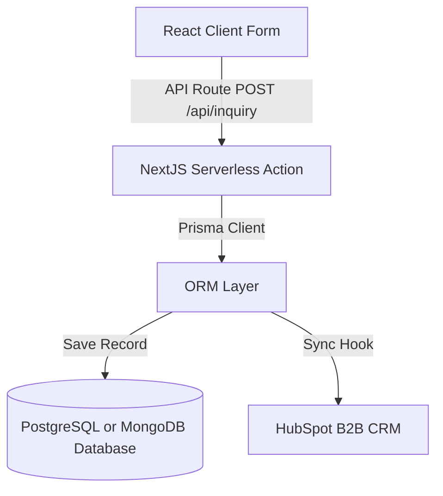

# Database & Data Model Guide - SPARKTECH Processes LLP

This document outlines how data is managed, structured, and serialized inside the SPARKTECH Processes website, detailing the static data model, inquiry schemas, and integration paths.

---

## 1. Architectural Philosophy: Why Static-First?

Industrial B2B project engineering sites require extremely high reliability, maximum speed, and optimal search ranking. To meet these targets, the SPARKTECH website avoids the latency overhead and complexity of a dynamic relational database (like MySQL or PostgreSQL) for content delivery.

### Key Advantages:
1. **Zero Database Downtime:** Page content is compiled at build-time. The site cannot crash due to database connection pool exhaustion or network failures.
2. **Instant Search Indexing:** Search engines receive raw HTML immediately, rather than waiting for hydration or client-side database queries.
3. **No Hosting Costs:** The static structure allows the complete application to be served directly from global content delivery networks (CDNs).

---

## 2. In-Memory Content Schemas

All dynamic-looking contents (e.g. Services, Technical Specs, and Archived Backups) are represented as typed TypeScript data models.

### A. Dynamic Service Model (`servicesData`)
Defined inside [page.tsx](file:///c:/Nitya%20Marketing%20projects/SPARKTECH%20Nextjs/SPARKTECH-website/src/app/services/%5Bslug%5D/page.tsx):

```typescript
interface ServiceRecord {
  title: string;          // Full marketing name of the service/plant
  subtitle: string;       // Secondary positioning tagline
  description: string;    // Comprehensive body copy describing the plant process
  sections: {             // Technical steps or sub-processes
    heading: string;
    content: string[];    // Array of paragraphs per technical section
  }[];
  image: string;          // Absolute path to high-res JPG illustration
  features: string[];     // Bullet points of key performance metrics
  applications: string[]; // List of seed types or raw products handled
  specs?: {               // Standard specification table attributes
    label: string;
    value: string;
  }[];
  process?: string[];     // Sequential step numbers for visual flow roadmap
}
```

### B. Global Contact Details (`siteContact`)
Structured inside [site.ts](file:///c:/Nitya%20Marketing%20projects/SPARKTECH%20Nextjs/SPARKTECH-website/src/lib/site.ts):

```typescript
export const siteContact = {
  officePhoneDisplay: string, // Display formatted phone number
  officePhoneHref: string,    // Tel link prefix for direct dialing
  emailDisplay: string,       // Public contact email
  emailHref: string,          // Mailto action link
  addressTitle: string,       // Address heading building name
  addressLines: string[],     // Individual street lines for typography separation
  whatsappNumber: string,     // E.164 formatted target phone for messaging
  whatsappMessage: string,    // Pre-encoded URI text for lead initialization
};
```

---

## 3. Lead & Inquiry Data Flow

The contact form handles lead qualification and captures the user's intent.

### A. Captured Fields (`InquirySchema`)
Defined in [ContactForm.tsx](file:///c:/Nitya%20Marketing%20projects/SPARKTECH%20Nextjs/SPARKTECH-website/src/app/contact/ContactForm.tsx):

| Field Name | Type | Requirement | Description |
|---|---|---|---|
| `name` | `string` | Required | Full name of the B2B contact person |
| `email` | `string` | Required | Corporate email address |
| `phone` | `string` | Required | Business phone number (including international dial-code) |
| `company` | `string` | Optional | Company name |
| `service` | `string` | Required | Target plant or machinery the lead is interested in |
| `message` | `string` | Required | Detailed description of process capacity and requirements |

### B. Client Cookie Memory Schema
The [ServiceCookieTracker.tsx](file:///c:/Nitya%20Marketing%20projects/SPARKTECH%20Nextjs/SPARKTECH-website/src/components/ServiceCookieTracker.tsx) tracks user interest.

* **Cookie Name:** `selected_service`
* **Format:** Raw String matching the `slug` parameter (e.g. `solvent-extraction`).
* **Lifespan:** 7 days (pre-fills the inquiry dropdown automatically).

---

## 4. Next-Phase Database Migration Path

If SPARKTECH decides to implement an admin panel to dynamically edit service parameters or save inquiries on a dedicated server database, use the following layout:



### Quick Migration Steps:
1. **Prisma Setup:** Install Prisma and initialize a schema.
   ```bash
   npm install prisma @prisma/client
   npx prisma init
   ```
2. **Define Database Model (`schema.prisma`):**
   ```prisma
   model LeadInquiry {
     id        String   @id @default(uuid())
     name      String
     email     String
     phone     String
     company   String?
     service   String
     message   String
     createdAt DateTime @default(now())
   }
   ```
3. **Connect API Endpoint:** Replace simulated submit handlers inside `ContactForm.tsx` with a standard fetch call to `/api/inquiry`.
